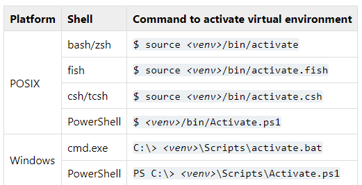

# flask-dashboard-demonstration
DT402 Workshop 3 Demonstration of a flask dashboard

## Summary

The steps we followed in the workshop are roughly as follows:

1. We added manually the `CCL_ecommerce.db` and the `requirements.txt` files from the .zip file with the materials in Aptem.
2. We created the virtual environment. The code used in codespaces to activate the environment might be different from what you need to do from your local VS Code terminal. I did the following:

```Bash
python -m venv ecommerce
source ecommerce/bin/activate
```
The code of the second line could be as follows, from [this source](https://docs.python.org/3/library/venv.html#creating-virtual-environments) which I shared in the chat.


3. We then installed the requirements:

```Bash
python -m pip install -r requirements.txt
```

4. We created the structure of the app, which should be as follows:
```
|--- flask-dashboard-demonstration
    |--- ecommerce
    |--- static
        |--- dashboard_script.js
        |--- dashboard_stylesheet.css
    |--- templates
        |--- dashboard.html
    |--- .gitignore
    |--- app.py
    |--- CCL_ecommerce.db
    |--- README.md
    |--- requirements.txt
```
Note that in the workshop it was mentioned that the `.gitignore` file should have the `ecommerce` word in it, to avoid pushing to github the virtual environment.

> [!NOTE]
> The `image.png` file is not in the above structure because it is just the image used for this README.md. We didn't use this in the workshop and is not necessary for the app to work.

5. We then added the code to `app.py`, `dashboard_script.js`, `dashboard_stylesheet.css`, `dashboard.html`.

6. We ran the app:
```
python app.py
```
This opens a localhost which shows the app.

